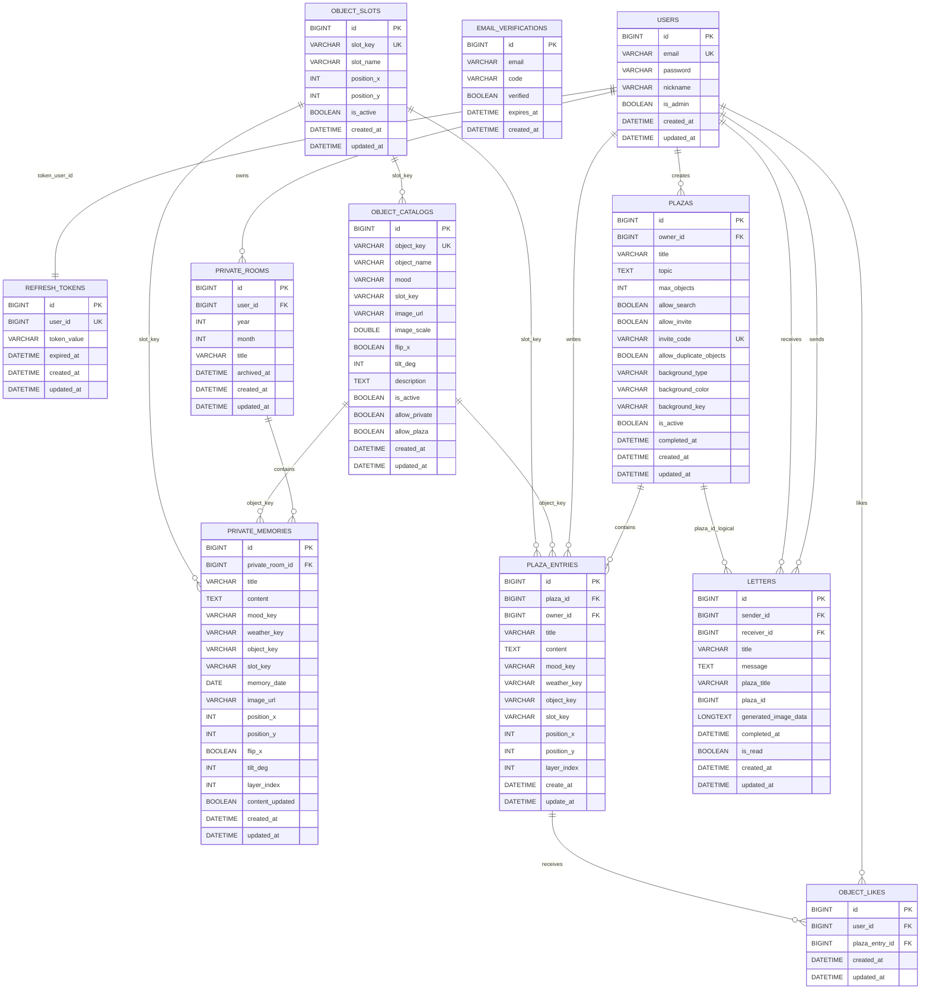

# Weather Of The Heart DB ERD

이 다이어그램은 현재 백엔드 JPA 엔티티 기준으로 정리한 구조입니다.
DBeaver에서 FK 선이 안 보일 수 있는 이유는 일부 관계가 실제 DB 외래키 제약이 아니라 `Long userId`, `Long plazaId`, `object_key`, `slot_key` 같은 값 참조로만 관리되기 때문입니다.

## 관계 메모

- `users.id` -> `private_rooms.user_id`
- `private_rooms.id` -> `private_memories.private_room_id`
- `users.id` -> `plazas.owner_id`
- `plazas.id` -> `plaza_entries.plaza_id`
- `users.id` -> `plaza_entries.owner_id`
- `users.id` -> `object_likes.user_id`
- `plaza_entries.id` -> `object_likes.plaza_entry_id`
- `users.id` -> `letters.sender_id`
- `users.id` -> `letters.receiver_id`

## 논리 참조

아래는 코드에서 값으로 연결하지만, 엔티티상 `@ManyToOne`으로 직접 매핑되지는 않은 관계입니다.

- `refresh_tokens.user_id` -> `users.id`
- `letters.plaza_id` -> `plazas.id`
- `private_memories.object_key` -> `object_catalogs.object_key`
- `plaza_entries.object_key` -> `object_catalogs.object_key`
- `object_catalogs.slot_key` -> `object_slots.slot_key`
- `private_memories.slot_key` -> `object_slots.slot_key`
- `plaza_entries.slot_key` -> `object_slots.slot_key`

